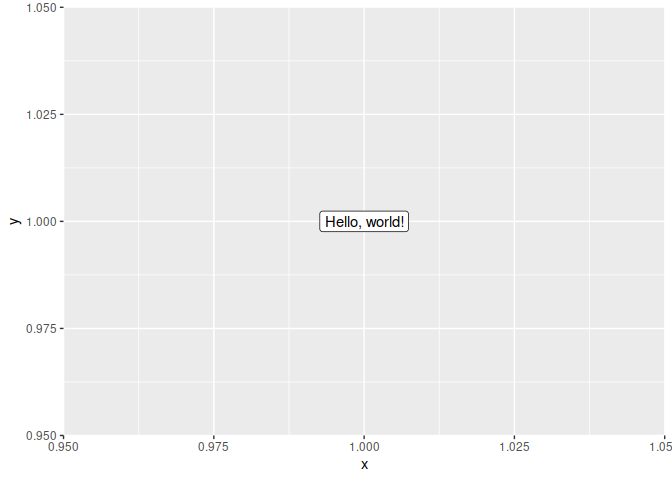

<!-- README.md is generated from README.Rmd. Please edit that file -->

# advRpckg

<!-- badges: start -->
<!-- badges: end -->

Package containing scripts and other information for the “Advanced R
Scripring” class

**Valid
[Datacamp](https://www.datacamp.com/groups/shared_links/41eaf0594835331d7a65ca8a83e94aaed1638b3155c42041702b5724763c5ee9)
class link**

## Assignment

**Create an R package containing the following:** 
  - ability to work with *.nc files
  - valid description file
  - readme file with basic package info
  - all functions (and data) should be documented
  - all functions should have valid tests
  - all functions should have correct error handling
  - correctly established methods for generic functions
  - package should pass basic check with no errors, no warnings and no notes

**Data**
  - data vailable [here](https://owncloud.cesnet.cz/index.php/s/HyKD3KXSOontoKX/download).

**What should the package do:**
  - package should be able to import *.nc files and calculate multiple IDF models
  - areas for IDF estimation can be chosen randomly (random cell numbers) or can be selected using a polygon (*.shp file)
  - result should be both graphical and numerical representation of the IDF model
  
## How to submit

**Submit (send to my email) only a link to your github repo.**

Package should be available on you github pages and containig the following guide for package instalation:

You can install the development version of advRpckg from GitHub with:

``` r
# install.packages("devtools")
devtools::install_github(repo = "strnda/advRpckg")
```

``` r
library(advRpckg)

hello()
#>           hello
#> 1 Hello, world!

plot(hello())
```



